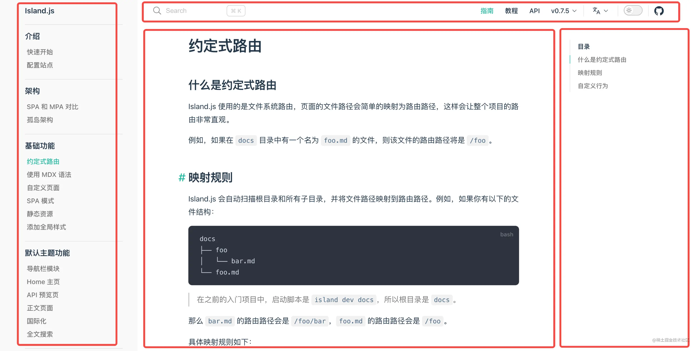
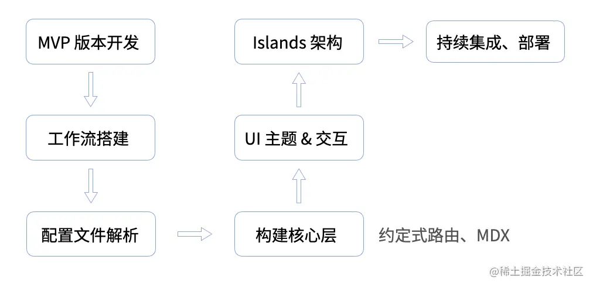
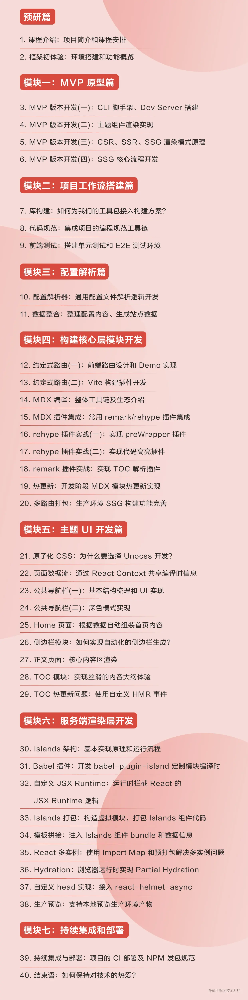

# 项目介绍及课程安排

[toc]

在这门课程当中我将会带大家基于 Vite 做一个完整的实战项目。

在目前的前端生态中，Vite 是一个比较热门的构建工具，相比于传统的 Webpack，它让前端开发者的开发效率有了质的提升。

方面它基于 Esbuild 以及浏览器 ES Module 的特性，让项目的启动和热更新速度明显加快，提升了前端开发者的幸福感；另一方面它兼容了 Rollup 的插件机制，在社区形成强大且丰富的生态。经过两年多的发展，Vite 的star 数量已经达到 50 k，社区中也诞生了许多基于 Vite 的上层框架，产生了非常多的社区插件。**正如官网所说的那样，Vite 正在逐步成为下一代的前端工具链！**

那我觉得**深入地学习和掌握 Vite 对于提升个人职场竞争力，拓宽职业发展道路而言都将是一个非常好的选择**。

## 要做什么？

简单来讲，我会在这门课程中教你基于 Vite 和 React 手写一个 VitePress 这样的框架。对于 VitePress 这类工具，大家可能有过一些使用的经历，用它搭建一些站点会非常简单。但**用轮子简单，造轮子却很复杂**：

1. 很多课程实现的项目都是玩具类型的项目，虽然可以一定程度上可以增加你的实战经验，但深度并不够，无法达到生产环境级别的可用程度；

2. 造轮子的过程涉及诸多工程化的环节，如开发阶段热更新、单元测试、E2E 测试、代码规范、持续集成和部署等，需要你对前端工具链和业界生态有足够多的积累；

3. 在开发框架的过程中需要我们频繁地接触底层的构建工具，甚至要自行编写插件去自定义工具的行为，需要我们对构建工具本身有深入理解

基于此，我将带大家从 0 到 1 实现一个真实的、仍在维护中的开源项目 [Island.js](https://github.com/sanyuan0704/island.js)。总的来说，这个项目整体的完成度比较高，基本上涵盖了 VitePress 官方所有功能，甚至更丰富。目前，项目的官网已经部署到了线上，你可以点击 [islandjs.dev](https://islandjs.dev/zh/) 访问官方站点。

> 官方站点也是采用 Island.js 搭建的，并且使用的是 Island.js 内置的一套默认 UI 主题。

举个例子，下图是一张文档详情页面，它包含了作为文档站的基本要素，有侧边栏、导航栏、正文内容和目录内容。

你可能会说，这么看好像也没什么特别的啊？事实上，这些模块都是通过框架自动生成的！在这里，用户只需要做一些简单的配置，专注于编写 Markdown 的内容，完整的页面就能自动出现了，是不是听起来非常酷？不光是文档详情页面，官网首页、API 页面也都能这样做出来。

## 课程是如何安排的？

那么，这个框架都包括哪些模块呢？

- CLI 命令行工具
- 基于 React 的默认 UI 主题
- 现代化的完整前端工作流
- 海量构建插件实战，包括 Vite 插件、Babel 插件、Markdown 编译插件
- 基于 Islands 架构的 SSR 构建与运行时系统

这门课程，我们就来详细讲解它们的实现逻辑。下面，我们来详细说说具体的课程安排。

首先是`前期准备阶段`，我们会开发出 MVP 版本，搭建好项目的开发工作流。

**在 MVP 版本开发部分**，我们会用最精简的教大家搭建起项目的 **MVP 版本**，实现传统的 SSR 同构架构，讲解 **CSR、SSR、SSG** 这些渲染模式的原理。

**在工作流的搭建部分**，我们会教大家从 0 搭建起项目所需要的基础设施，包括库构建工具、单元测试与 E2E(端到端) 测试环境，以及怎么接入代码规范工具。

接着就正式地进入到项目的核心功能开发阶段了。

**在配置文件的解析开发环节**，我们会带大家设计配置文件的结构，开发一个通用的配置解析器。

**在构建核心层开发环节**，我们会进行约定式路由的开发，带大家完成我们的第一个 Vite 插件，根据文件系统自动生成 React 组件的路由信息。

**MDX 工具链开发环节**，我们将在这个环节系统地学习 Markdown 编译相关的生态以及工具链，接入一些常见的 Markdown 编译插件，当然也会教大家如何去自定义 Markdown 编译插件，从而完成一些定制化的功能需求。

**主题 UI 的开发环节**，我们将基于 React 完整地实现页面的核心 UI 模块，并完成页面的各种交互能力。当然了，在实战中，我们也不可避免地会遇到一些疑难杂症，比如组件热更新失效的问题，我们也会带你详细地拆解这些问题，一步步将它们解决掉。

然后，我们会来到整门课程难度最大的一章，也就是基于 **Islands 架构的服务端渲染层开发**。Islands 架构是业界比较新的一个 SSR 架构趋势，相比于传统的 SSR 同构方案，会带来非常深度的性能优化。**我们将带大家仔细地剖析 Islands 架构的实现原理，带你一步步地搭建起整体的构建与运行时系统**。 这也是目前社区非常稀缺的资料，相信学习完后能够对你的实战能力和技术视野有很大提升！

开发好基本功能后，我们还会带大家学习持续集成和部署，也就是做 CI、CD 的流程编排，最后安全地发布一个 NPM 包到社区。

总的来说，这门课程一方面可以让大家在实战中加深对 Vite 构建工具的理解，从真实的场景当中学习到 Vite 的使用技巧与注意事项，另一方面也是带大家通过项目来深入地学习前端工程化领域相关的知识，提升工程化的实战能力。

## 保姆级教程

那需要什么样的基础才能学习这门课程呢？具备如下一些基础语法知识：

- React 组件基本语法
- 基本的 TypeScript 语法
- 常用 Node.js 的模块，如 fs、path